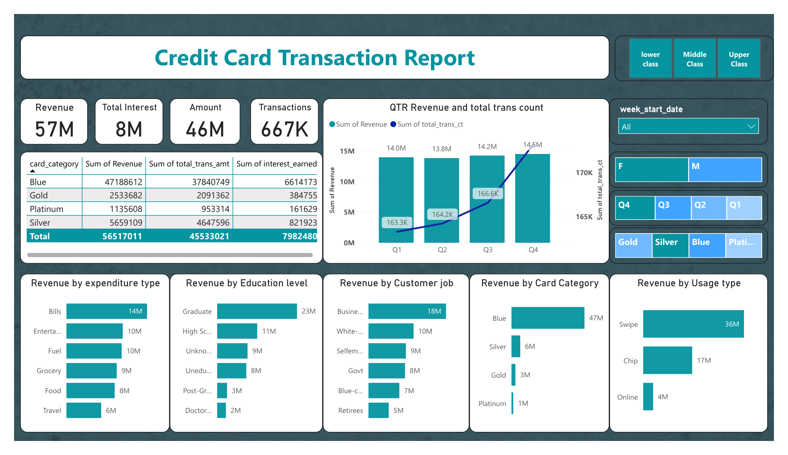
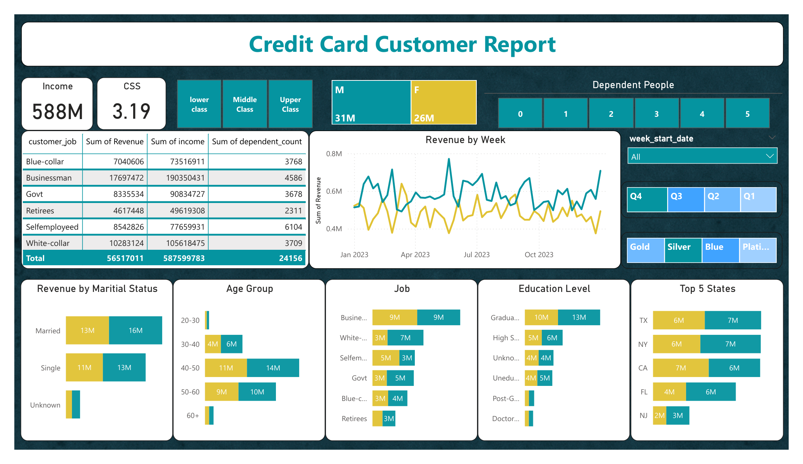
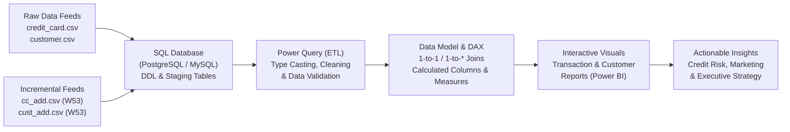

# 💳 Credit Card Financial & Customer Analytics Dashboard

[](https://powerbi.microsoft.com/)
[](https://www.postgresql.org/)
[](#-dax-measures--business-logic)
[](https://www.python.org/)
[](LICENSE)

> A comprehensive, real-world Financial Intelligence and Customer Analytics Dashboard built with **Power BI**, **SQL**, and **DAX**. Designed for retail banking and credit risk management teams to monitor transaction performance, customer acquisition costs, card utilization, delinquency risk, and demographic revenue drivers across **10,290+ accounts** generating over **$56.5M in revenue**.

---

## 📑 Table of Contents
- [Executive Overview](#-executive-overview)
- [Dashboard Visual Showcase](#-dashboard-visual-showcase)
  - [1. Credit Card Transaction Report](#1-credit-card-transaction-report)
  - [2. Credit Card Customer Report](#2-credit-card-customer-report)
- [Key Performance Indicators (KPIs)](#-key-performance-indicators-kpis)
- [Architecture & Data Pipeline](#-architecture--data-pipeline)
- [Repository Structure](#-repository-structure)
- [Data Dictionary & Dataset Overview](#-data-dictionary--dataset-overview)
- [SQL Data Pipeline & Ingestion](#-sql-data-pipeline--ingestion)
- [DAX Measures & Business Logic](#-dax-measures--business-logic)
- [Key Insights & Business Findings](#-key-insights--business-findings)
- [Strategic Business Recommendations](#-strategic-business-recommendations)
- [How to Set Up & Reproduce](#-how-to-set-up--reproduce)
- [Project Documentation Hub](#-project-documentation-hub)

---

## 🚀 Executive Overview

Retail credit card portfolios generate revenue through multiple interconnected streams: transaction interchange fees, finance charges on revolving credit, and recurring annual membership dues. Understanding consumer spending patterns, delinquency probabilities, channel adoption, and customer satisfaction is vital to maintaining portfolio profitability.

This project delivers an end-to-end business intelligence solution that:
1. **Tracks Financial KPIs**: Real-time tracking of gross revenue ($56.52M), transaction volume ($45.53M), interest earnings ($7.98M), and annual card fees ($3.00M).
2. **Evaluates Channel & Spend Behavior**: Pinpoints top expenditure categories (Bills, Entertainment, Fuel, Grocery) and checkout authentication types (Swipe, Chip, Online).
3. **Segments Customer Demographics**: Unveils high-yield customer cohorts by income class, age bracket, education, occupation, and marital status.
4. **Enables Time-Intelligence & Incremental Refreshes**: Seamlessly ingests supplemental weekly data feeds (`cc_add.csv`, `cust_add.csv`) to compute Week-over-Week (WoW) operational momentum (e.g., **+28.8% holiday revenue spike**).
5. **Monitors Credit Health & Risk**: Quantifies portfolio delinquency rates (6.06%), credit line utilization (27.45%), and 30-day card activation rates (57.46%).

---

## 📊 Dashboard Visual Showcase

### 1. Credit Card Transaction Report
Focuses on operational financial health, spending categories, card categories, quarterly comparisons, and point-of-sale technology.



#### Visual Elements & Highlights:
- **Top Summary Cards**: Total Revenue (**$57M** / $56.52M), Net Interest (**$8M** / $7.98M), Gross Spend Amount (**$46M** / $45.53M), and Settled Transactions (**667K**).
- **Quarterly Trend (Combo Chart)**: Dual-axis visualization illustrating revenue stability ($13.8M–$14.5M) and steady transaction volume growth across Q1–Q4.
- **Expenditure Breakdown (Bar Chart)**: Ranks spend categories led by **Bills ($14M)**, **Entertainment ($10M)**, and **Fuel ($10M)**.
- **Card Tier Financial Matrix**: Detailed matrix cross-tabulating revenue, spend amount, and interest accrued across **Blue**, **Silver**, **Gold**, and **Platinum** cardholders.
- **Interactive Slicers**: Multi-select filter pane for Quarter (Q1–Q4), Gender (M/F), Card Type, Income Group (Lower, Middle, Upper), and Week Date.

---

### 2. Credit Card Customer Report
Focuses on customer demographics, socioeconomic tiering, geographical performance, and customer sentiment (CSS).



#### Visual Elements & Highlights:
- **Demographic KPIs**: Total Customer Income (**$588M**), Customer Satisfaction Score (**3.19 / 5.0**), and Total Revenue (**$57M**).
- **Weekly Revenue Progression (Area Chart)**: Chronological revenue line charting spend patterns throughout all 53 weeks, broken down by gender.
- **Demographic Cohort Analysis (Grouped Bars)**: Revenue contribution across 5 age brackets, highlighting the dominance of the **40–50 age group ($24.7M)**.
- **Occupational Breakdown**: Comparative earning power and portfolio spend across Business owners, White-collar workers, Self-employed individuals, and Government employees.
- **Geographic Concentration (Top 5 States)**: Bar chart showing state-level revenue from **Texas (TX)**, **New York (NY)**, **California (CA)**, **Florida (FL)**, and **New Jersey (NJ)**.

---

## 📈 Key Performance Indicators (KPIs)

| KPI Metric | Value | Business Context & Definition |
| :--- | :--- | :--- |
| **Total Revenue** | **$56,517,011** | Sum of Annual Fees + Transaction Spend + Interest Earned |
| **Total Transaction Amount** | **$45,533,021** | Total monetary volume transacted across the cardholder base |
| **Total Interest Earned** | **$7,982,480** | Net financing interest collected from revolving balances |
| **Total Annual Fees** | **$3,001,510** | Recurring membership and subscription fee revenue |
| **Total Transactions** | **667,234** | Aggregate count of settled card transactions |
| **Total Customer Income** | **$587,599,783** | Combined gross annual income of monitored customer base |
| **Average Satisfaction Score** | **3.19 / 5.00** | Standardized Customer Satisfaction Score (CSS) |
| **Portfolio Delinquency Rate** | **6.06%** | Share of accounts past-due or in default status |
| **30-Day Card Activation Rate** | **57.46%** | Percentage of cards actively transacting within 30 days of receipt |
| **Average Credit Utilization** | **27.45%** | Average revolving balance divided by credit limit |
| **Avg Customer Acq Cost (CAC)** | **$96.29** | Average acquisition expense per acquired customer |
| **Week-over-Week Revenue Surge** | **+28.77%** | Growth in revenue between Week-52 and Week-53 (Year-End) |

---

## 🏗 Architecture & Data Pipeline



1. **Data Ingestion**: Initial load of 10,108 accounts (Weeks 1–52) into structured relational tables (`cc_detail` and `cust_detail`).
2. **Incremental Ingestion**: Refresh pipeline simulating weekly production updates with Week-53 data (185 records).
3. **Power Query ETL**: Standardized date formats (DD-MM-YYYY), resolved column header naming differences (`Total_Trans_Ct` vs `Total_Trans_Vol`), and created sorting indices.
4. **Semantic Layer & Modeling**: Established relationships on `Client_Num`, calculated socio-economic bins, and created dynamic time-intelligence measures.
5. **Dashboard Presentation**: Exported high-fidelity PDF and image reports for executive decision-making.

---

## 📁 Repository Structure

```plaintext
Credit_Card_Financial_Dashboard/
│
├── assets/                                      # Rendered dashboard visual previews
│   ├── credit_card_transaction_report.png       # Page 1 preview (2075 x 1200)
│   └── credit_card_customer_report.png          # Page 2 preview (2075 x 1200)
│
├── docs/                                        # In-depth project documentation
│   ├── DATA_DICTIONARY.md                       # Comprehensive schema & column definitions
│   ├── SQL_SCRIPTS.sql                          # Database DDL, ETL & analytical queries
│   ├── DAX_MEASURES.md                          # Complete catalog of DAX formulas
│   └── BUSINESS_INSIGHTS_REPORT.md              # Executive financial & risk analysis report
│
├── credit_card.csv                              # Historical card performance data (Weeks 1–52)
├── customer.csv                                 # Historical customer demographic profiles
├── cc_add.csv                                   # Incremental transaction data (Week 53)
├── cust_add.csv                                 # Incremental customer profile data (Week 53)
│
├── Credit_Card_Transaction_Report.pdf           # Power BI exported report (Transaction view)
├── Credit_Card_Customer_Report.pdf              # Power BI exported report (Customer view)
└── README.md                                    # Project overview & documentation index
```

---

## 📖 Data Dictionary & Dataset Overview

The dataset integrates transactional records with customer demographic profiles:

### 1. `credit_card` / `cc_detail`
- **Identifier**: `Client_Num` (Unique 9-digit account ID)
- **Account Specs**: `Card_Category` (Blue, Silver, Gold, Platinum), `Annual_Fees`, `Credit_Limit`, `Avg_Utilization_Ratio`
- **Spend & Activity**: `Total_Trans_Amt`, `Total_Trans_Vol`, `Total_Revolving_Bal`, `Interest_Earned`
- **Transaction Context**: `Exp Type` (Bills, Entertainment, Fuel, Grocery, Food, Travel), `Use Chip` (Swipe, Chip, Online)
- **Operational & Risk Flags**: `Activation_30_Days`, `Customer_Acq_Cost`, `Delinquent_Acc`
- **Time Dimensions**: `Week_Start_Date`, `Week_Num`, `Qtr`, `current_year`

### 2. `customer` / `cust_detail`
- **Demographics**: `Customer_Age`, `Gender`, `Dependent_Count`, `Marital_Status`
- **Socioeconomics**: `Education_Level`, `Customer_Job`, `Income`
- **Geography**: `state_cd`, `Zipcode`
- **Assets & Liability**: `Car_Owner`, `House_Owner`, `Personal_loan`
- **Sentiment**: `Cust_Satisfaction_Score` (Scale 1–5)

👉 *For full details, data types, nullability rules, and value distributions, see [`docs/DATA_DICTIONARY.md`](docs/DATA_DICTIONARY.md).*

---

## 🗄 SQL Data Pipeline & Ingestion

The repository includes a production-ready SQL script compatible with **PostgreSQL**, **MySQL**, and **SQL Server**.

### Table Creation (DDL)
```sql
CREATE TABLE cust_detail (
    Client_Num BIGINT PRIMARY KEY,
    Customer_Age INT,
    Gender CHAR(1),
    Dependent_Count INT,
    Education_Level VARCHAR(50),
    Marital_Status VARCHAR(30),
    state_cd VARCHAR(10),
    Zipcode VARCHAR(20),
    Car_Owner VARCHAR(10),
    House_Owner VARCHAR(10),
    Personal_loan VARCHAR(10),
    contact VARCHAR(30),
    Customer_Job VARCHAR(50),
    Income DECIMAL(12, 2),
    Cust_Satisfaction_Score INT
);

CREATE TABLE cc_detail (
    Client_Num BIGINT,
    Card_Category VARCHAR(30),
    Annual_Fees DECIMAL(10, 2),
    Activation_30_Days INT,
    Customer_Acq_Cost DECIMAL(10, 2),
    Week_Start_Date DATE,
    Week_Num VARCHAR(20),
    Qtr VARCHAR(10),
    current_year INT,
    Credit_Limit DECIMAL(12, 2),
    Total_Revolving_Bal DECIMAL(12, 2),
    Total_Trans_Amt DECIMAL(12, 2),
    Total_Trans_Vol INT,
    Avg_Utilization_Ratio DECIMAL(8, 4),
    Use_Chip VARCHAR(30),
    Exp_Type VARCHAR(50),
    Interest_Earned DECIMAL(10, 2),
    Delinquent_Acc INT,
    CONSTRAINT fk_customer FOREIGN KEY (Client_Num) REFERENCES cust_detail(Client_Num)
);
```

### Analytical Verification Query
```sql
-- Verify Total Revenue, Transaction Volume, and Delinquency
SELECT 
    COUNT(DISTINCT c.Client_Num) AS total_customers,
    SUM(cc.Annual_Fees + cc.Total_Trans_Amt + cc.Interest_Earned) AS total_revenue,
    SUM(cc.Total_Trans_Amt) AS total_trans_amount,
    SUM(cc.Interest_Earned) AS total_interest_earned,
    SUM(cc.Total_Trans_Vol) AS total_transactions,
    ROUND(AVG(cc.Delinquent_Acc) * 100, 2) AS delinquency_rate_pct
FROM cc_detail cc
JOIN cust_detail c ON cc.Client_Num = c.Client_Num;
```

👉 *For the complete ETL, data ingestion, and analytical SQL suite, see [`docs/SQL_SCRIPTS.sql`](docs/SQL_SCRIPTS.sql).*

---

## 🧮 DAX Measures & Business Logic

### Row-Level Financial Measure (Calculated Column)
```dax
Revenue = 'cc_detail'[Annual_Fees] + 'cc_detail'[Total_Trans_Amt] + 'cc_detail'[Interest_Earned]
```

### Age Cohort Segmentation
```dax
AgeGroup = 
SWITCH(
    TRUE(),
    'cust_detail'[Customer_Age] < 30, "20-30",
    'cust_detail'[Customer_Age] >= 30 && 'cust_detail'[Customer_Age] < 40, "30-40",
    'cust_detail'[Customer_Age] >= 40 && 'cust_detail'[Customer_Age] < 50, "40-50",
    'cust_detail'[Customer_Age] >= 50 && 'cust_detail'[Customer_Age] < 60, "50-60",
    'cust_detail'[Customer_Age] >= 60, "60+",
    "Unknown"
)
```

### Income Class Classification
```dax
IncomeGroup = 
SWITCH(
    TRUE(),
    'cust_detail'[Income] < 35000, "lower class",
    'cust_detail'[Income] >= 35000 && 'cust_detail'[Income] < 70000, "Middle Class",
    'cust_detail'[Income] >= 70000, "Upper Class",
    "Unknown"
)
```

### Week-over-Week (WoW) Revenue Growth
```dax
Current_Week_Revenue = 
VAR LatestWeek = MAX('cc_detail'[Week_Num_Int])
RETURN
CALCULATE(
    SUM('cc_detail'[Revenue]),
    FILTER(ALL('cc_detail'), 'cc_detail'[Week_Num_Int] = LatestWeek)
)

Previous_Week_Revenue = 
VAR LatestWeek = MAX('cc_detail'[Week_Num_Int])
RETURN
CALCULATE(
    SUM('cc_detail'[Revenue]),
    FILTER(ALL('cc_detail'), 'cc_detail'[Week_Num_Int] = LatestWeek - 1)
)

WoW_Revenue_Growth = 
DIVIDE(
    [Current_Week_Revenue] - [Previous_Week_Revenue],
    [Previous_Week_Revenue],
    0
)
```

👉 *For the full library of measures, see [`docs/DAX_MEASURES.md`](docs/DAX_MEASURES.md).*

---

## 🔍 Key Insights & Business Findings

### 1. The Core Revenue Engine
- **Blue Card Dominance**: Generates **83.5% ($47.19M)** of portfolio revenue and **591K transactions**.
- **Prime Demographic (Ages 40–50)**: Represents the single largest spending demographic (**$24.73M**, 43.8% of portfolio revenue), followed by ages **50–60 ($18.62M)**.
- **Top Occupations**: **Businessmen** generate **$17.70M** in revenue with high average balances and low delinquency (**5.27%**).

### 2. Geographic & Spending Concentration
- **Top 5 States**: Cardholders in **TX ($13.0M)**, **NY ($13.0M)**, **CA ($12.9M)**, **FL ($10.0M)**, and **NJ ($4.4M)** generate **94.2%** of all revenue.
- **Essential Spend Categories**: Over **24.7% ($14.0M)** of all revenue is generated by recurring **Bills & Utilities**, followed by Entertainment ($9.8M) and Fuel ($9.6M).

### 3. Year-End Holiday Surge (Week 53 vs Week 52)
- **+28.77% WoW Revenue Growth** ($1,201,601 vs $933,134).
- **+35.04% WoW Transaction Spend Growth** ($1,011,008 vs $748,677).
- Transaction volume increased by **+3.39%**, demonstrating that holiday spending was driven primarily by higher average ticket size rather than just transaction frequency.

### 4. Critical Friction Points & Risk Signals
- **Low Activation Rate (57.46%)**: Over 42% of newly issued cards remain inactive after 30 days, causing unrecouped CAC ($96.29 avg).
- **Premium Tier Dissatisfaction**: Platinum cardholders report a satisfaction score of only **2.72 / 5.0**, compared to **3.22 for Silver** and **3.20 for Blue**.
- **Delinquency Risks**: Government employees exhibit the highest delinquency rate at **7.27%**, followed by Self-employed individuals at **6.51%**.

👉 *For the complete executive briefing, see [`docs/BUSINESS_INSIGHTS_REPORT.md`](docs/BUSINESS_INSIGHTS_REPORT.md).*

---

## 💡 Strategic Business Recommendations

| # | Strategic Initiative | Focus Area | Actionable Steps |
| :- | :--- | :--- | :--- |
| **1** | **30-Day Onboarding Acceleration** | Card Activation | Implement multi-touch automated SMS/email triggers and offer a $\$25$ statement credit upon achieving $\$100$ spend within the first 14 days. |
| **2** | **Platinum Card Value Revamp** | Customer Retention | Restructure premium perks (airport lounge access, dining multipliers, annual fee waivers upon $\$15\text{K}$ spend) to improve customer satisfaction from 2.72 to $>3.5$. |
| **3** | **Digital Wallet Push** | E-Commerce Adoption | Currently, Online transactions make up only **6.2%** of revenue. Run merchant partnership campaigns with Amazon, Walmart, and Apple Pay to expand digital spend. |
| **4** | **Early Warning Delinquency Monitoring** | Risk Management | Set automated payment alert notifications for accounts with credit utilization $>70\%$, specifically targeting high-risk occupational cohorts. |
| **5** | **Regional Market Expansion** | Geographic Diversification | Create targeted regional marketing campaigns in emerging growth markets beyond the top 5 states to reduce geographic concentration risk. |

---

## 🛠 How to Set Up & Reproduce

### Prerequisites
- **Power BI Desktop** (Latest Version)
- **PostgreSQL / MySQL** (Optional for database staging)
- **Python 3.10+** (Optional for automated validation)

### Step 1: Clone the Repository
```bash
git clone https://github.com/Ganesh172919/credit-card.git
cd credit-card
```

### Step 2: Ingest Data via SQL (Optional)
1. Open your SQL client (pgAdmin, DBeaver, or MySQL Workbench).
2. Execute the script in [`docs/SQL_SCRIPTS.sql`](docs/SQL_SCRIPTS.sql) to create the schema.
3. Import `customer.csv` and `credit_card.csv` using the provided `COPY` or `LOAD DATA` commands.
4. Run the incremental load commands with `cust_add.csv` and `cc_add.csv`.

### Step 3: Open in Power BI Desktop
1. Launch **Power BI Desktop**.
2. Select **Get Data** $\rightarrow$ **Text/CSV** and load `credit_card.csv` and `customer.csv` (or connect directly to your SQL database).
3. In **Power Query Editor**, verify data types:
   - Convert `Week_Start_Date` to `Date` format.
   - Verify `Client_Num` is formatted as `Whole Number` / `Text`.
4. Apply the custom DAX measures from [`docs/DAX_MEASURES.md`](docs/DAX_MEASURES.md).
5. Build the visualizations following the visual layouts in the [Showcase](#-dashboard-visual-showcase).

---

## 📚 Project Documentation Hub

| Document | Purpose |
| :--- | :--- |
| 📄 [`docs/DATA_DICTIONARY.md`](docs/DATA_DICTIONARY.md) | Exhaustive column definitions, value domains, constraints, and business logic. |
| 📄 [`docs/SQL_SCRIPTS.sql`](docs/SQL_SCRIPTS.sql) | DDL, bulk ingestion scripts, incremental updates, and validation queries. |
| 📄 [`docs/DAX_MEASURES.md`](docs/DAX_MEASURES.md) | Catalog of calculated columns, KPI measures, and time-intelligence DAX formulas. |
| 📄 [`docs/BUSINESS_INSIGHTS_REPORT.md`](docs/BUSINESS_INSIGHTS_REPORT.md) | Executive financial report, demographic breakdowns, risk analysis, and roadmap. |

---

## 👤 Author & Acknowledgments

- **Author**: Ganesh Reddy
- **Repository**: [Ganesh172919/credit-card](https://github.com/Ganesh172919/credit-card)
- **Role**: Data Analyst / Business Intelligence Developer

*Contributions, issues, and feature requests are welcome! If you find this project helpful, feel free to give it a ⭐️!*